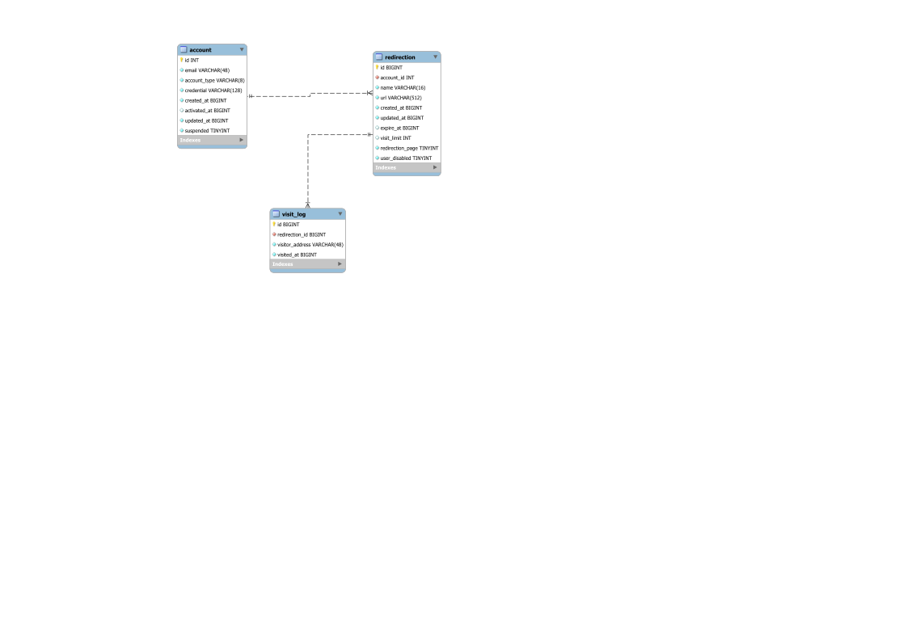

# Pancake Resource Locator
Modular URL Shortener

## Requirement
* MySQL db server
* Java 17+
* Java web application server
* Jakarta EE (Previously JavaEE)

## Structure

* See `api-server` directory for API server app
* See `server` directory for Pancake Resource Locator server app
* See `redirect-server` directory for redirection server app

### Database

## License
Pancake Resource Locator is licensed under GPLv3

See `LICENSE` file for full text
